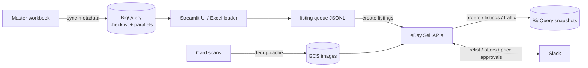

# Shoebox

*Every card collector keeps a shoebox. This one runs an eBay store.*

[](https://github.com/coperyan/shoebox/actions/workflows/ci.yml)
[](https://www.python.org/)
[](LICENSE)

A Python toolkit that runs the operational loop of an eBay sports-card store —
metadata management, bulk listing creation, image handling, monitoring, and
lifecycle automation — wiring together the eBay Sell/Trading APIs, Google Cloud
(GCS + BigQuery), a Streamlit UI, and Slack.

Automate common workflows for an eBay sports card store:
- Maintain checklist + parallel metadata in **BigQuery**
- Build a **listing queue** via Streamlit UI
- Upload scans to **GCS** with a local cache to avoid re-uploads
- Create eBay listings via `ebay_rest`
- Log outputs to **JSONL → GCS → BigQuery**
- Download existing listing details and performance metrics for monitoring
- **Slack** notifications, interactive price approvals, and a chat command bot

📚 **Full documentation lives in [`docs/`](docs/README.md)** — architecture,
setup, configuration reference, CLI reference, pipeline details, the Slack
integration, and data/storage layout. This README is a quick orientation.

---

## Repository overview

Core components follow a simple pattern:

- **models/**: typed objects (Pydantic) that represent queue rows, logs, listing results
- **transforms/**: convert queue rows into eBay payloads (inventory item + offer)
- **clients/**: external systems (eBay, GCS, BigQuery)
- **pipelines/**: end-to-end runnable workflows

Typical flow:

1) Queue rows created in UI  
2) Images uploaded to GCS (with cache)  
3) Listing payloads built from queue rows  
4) eBay listing created (inventory item → offer → publish)  
5) Results appended to JSONL logs  
6) Logs uploaded to GCS + appended to BigQuery  
7) Local logs flushed after successful upload/load



> A fuller architecture diagram and component map live in
> [`docs/overview.md`](docs/overview.md).

---

## Setup

### Python environment
```bash
python -m venv .venv
source .venv/bin/activate   # Windows: .\.venv\Scripts\Activate.ps1
pip install -U pip
pip install -e .
```

### eBay REST client
This project uses the third‑party library:
- https://github.com/matecsaj/ebay_rest

Install it (editable recommended) and create `ebay_rest.json`
in the directory referenced by `settings.ebay.path`.

---

## Google Cloud authentication

Local development:
```bash
gcloud auth application-default login
```

Automation / CI:
```bash
export GOOGLE_APPLICATION_CREDENTIALS=/path/to/service-account.json
```

Required permissions:
- GCS: object write access to image + log buckets
- BigQuery: load jobs / append access to dataset

---

## Configuration

All runtime configuration is centralized in `configs/app.yaml`, validated by
`settings.py`. Copy `configs/app.yaml.example` (and the other
`configs/*.example` templates) to get started — see
[docs/configuration.md](docs/configuration.md) for the full reference.

Key settings:
- `settings.gcs.image_bucket` / `image_log_bucket` / `ebay_bucket` / `metadata_bucket`
- `settings.bigquery.checklist_dataset` / `ebay_dataset` / `images_dataset`
- `settings.paths.scans_dir` / `query_dir` / `exports_dir`
- `settings.ebay.path`
- `settings.slack.*` (see [docs/slack.md](docs/slack.md))
- `settings.store.*` — store-specific eBay values (name, merchant location key,
  category, business-policy IDs, ad campaigns, offer message). These are **not**
  hardcoded; set your own under `store:` in `app.yaml`.

Also copy the sample metadata workbook to the path the sync expects:
```bash
cp tools/checklist_parallel_metadata.sample.xlsx tools/checklist_parallel_metadata.xlsm
```

---

## Streamlit UI

Run:
```bash
shoebox ui
# equivalently: streamlit run shoebox/ui/app.py
```

Purpose:
- Select set / subset / parallel metadata
- Enter card-specific details
- Attach front/back scans
- Export listing queue rows

---

## Pipelines

### Create listings
```bash
shoebox create-listings [--dry-run] [--publish] [--schedule] [--scrape-prices]

# Multi-variation ("You Pick") listings from an inventory workbook:
shoebox create-variation-listings --excel-path inventory.xlsx [--dry-run] [--publish]
```

Every mutating pipeline (`create-listings`, `create-variation-listings`,
`relist-listings`, `send-offers`) supports `--dry-run` and creates offers
unpublished unless `--publish` is passed. See [docs/cli.md](docs/cli.md) for
every command and flag.

### Sync Topps release calendar

Mirrors upcoming releases from
[topps.com/release-calendar](https://www.topps.com/release-calendar) into a
Google Calendar. Each release becomes a 15-minute event at 9:00 AM
`America/Los_Angeles` on the release date with reminders 1 day and 30
minutes before. Newly created events are announced to the Slack
`notify_channel`. Re-runs are idempotent — existing events are patched in place,
not duplicated, and Slack is only pinged for new events.

```bash
python -m shoebox.pipelines.sync_topps_calendar --dry-run   # preview
python -m shoebox.pipelines.sync_topps_calendar             # apply
```

Add to `configs/app.yaml`:

```yaml
google_calendar:
  calendar_id: "your-calendar-id@group.calendar.google.com"
```

One-time setup:

1. Enable the Google Calendar API on the GCP project that owns
   `gcp.service_account_json`.
2. In Google Calendar → *Settings → Share with specific people* → add the
   service-account email (`...@<project>.iam.gserviceaccount.com`) with
   **Make changes to events**. Service accounts cannot self-grant access;
   the calendar must be shared with them explicitly.
3. Copy the calendar's ID from *Settings → Integrate calendar → Calendar ID*
   into `google_calendar.calendar_id`.

The scraper drives a real Chrome via `undetected-chromedriver` (the page
returns 403 to plain HTTP), so a working Chrome install is required on the
host that runs the pipeline.

---

## Image logging & caching

Two local JSONL files:
- `image_cache.jsonl` – persistent cache index
- `image_log_append.jsonl` – net-new uploads only

After successful upload to GCS and append to BigQuery,
the append file is flushed locally.

---

## Listing result logging

Listing results are written to:
- `exports/jsonl/ebay_listings.jsonl`

At the end of a successful run, the file is:
1) uploaded to GCS
2) appended into BigQuery
3) deleted locally

---

## Existing listings

Listings created manually can be ingested by:
- collecting listing IDs
- fetching full details via Trading API `GetItem`
- storing results as JSONL → GCS → BigQuery

---

## Troubleshooting

**ADC auth error**
```bash
gcloud auth application-default login
```

**Datetime not JSON serializable**
Use:
- `model.model_dump_json()` (Pydantic)
- or `to_jsonable_python(...)` before `json.dumps`

**Offer already exists**
Generate a new SKU per relist or reuse/update existing offers.

---

## Disclaimer

This project was built to run a specific eBay sports-card store and is shared
as a reference/portfolio piece. It automates actions against **live** eBay,
Google Cloud, and Slack accounts and can create, reprice, and end real
listings. Use it against your own accounts, review the code before running any
publishing pipeline (start with `--dry-run`), and make sure your usage complies
with the terms of service of eBay, 130point, and any other site it touches
(some flows scrape pages via Selenium). No warranty; use at your own risk.

## License

Released under the [MIT License](LICENSE) — free to use, modify, and adapt for
your own automation needs.
