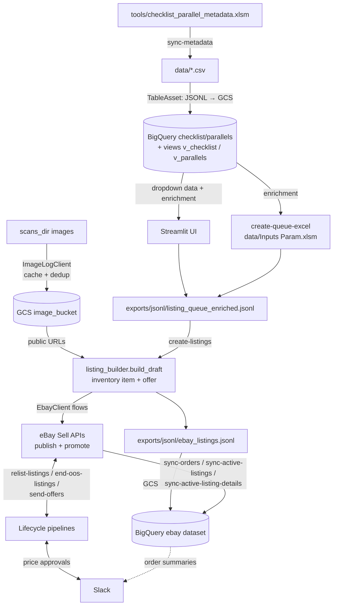

# Overview & Architecture

## What this project does

`shoebox` automates the operational loop of an eBay sports-card store:

1. **Metadata management** — a master Excel workbook of card checklists and
   parallels is synced into BigQuery, becoming the source of truth that every
   other workflow joins against.
2. **Listing creation** — a queue of cards to list is built either in a
   Streamlit UI or from an Excel input sheet, enriched against the BigQuery
   metadata, and published to eBay through the Sell (Inventory/Offer) APIs,
   including scheduled listings, promoted-listing ads, and multi-variation
   "You Pick / Complete Your Set" listings.
3. **Image handling** — card scans are uploaded to GCS with a local dedup
   cache so re-runs never re-upload, and every upload is logged to BigQuery.
4. **Monitoring** — orders, active listings, listing details, and traffic
   metrics are snapshotted from eBay into BigQuery on a recurring basis.
5. **Lifecycle automation** — stale listings are relisted with updated
   pricing (human-approved via Slack), out-of-stock listings are ended,
   negotiation offers are sent to watchers, and Topps release dates are
   scraped into a Google Calendar.
6. **Slack integration** — pipelines notify a Slack channel, price changes
   are approved with an interactive button (or overridden with a threaded
   reply), and a command bot runs whitelisted CLI commands from chat.

## Component map

The package follows a layered layout under `shoebox/`:

| Layer | Directory | Role |
|---|---|---|
| Models | `models/` | Pydantic v2 types: queue rows, image-log entries, listing drafts/results, typed views of eBay API payloads (`models/ebay/`) |
| Transforms | `transforms/` | Pure(ish) builders: queue row → eBay inventory-item/offer payloads, CSV normalizers, queue enrichment against BigQuery |
| Clients | `clients/` | External systems: GCS, BigQuery, eBay REST (`clients/ebay_rest/`), eBay Trading API (`ebay_legacy.py`), 130point price scraper, Topps release scraper, Google Calendar, image log, saved-search state (`search_state.py`) |
| Pipelines | `pipelines/` | End-to-end runnable workflows (one per CLI command, roughly) |
| Services | `services/` | Long-running or interactive components: the Slack command bot, the orders-awaiting-shipment display/messenger |
| UI | `ui/` | Streamlit app for building the listing queue |
| Utils | `utils/` | Slack messaging (`slack.py`, `slack_formatting.py`), pricing math and reply parsing (`pricing.py`), SKU hashing, JSONL helpers, ad-campaign routing, team-name shortening, rich-table rendering |
| Storage | `storage/` | `TableAsset` — the CSV → JSONL → GCS → BigQuery loading abstraction used by metadata sync |
| Settings | `settings.py` | Pydantic-validated config loaded from `configs/app.yaml` (cached accessor `get_settings()`) |
| CLI | `cli.py` | argparse entrypoint; the `shoebox` console script |

Supporting directories at the repo root:

| Path | Contents |
|---|---|
| `configs/` | `app.yaml` and `searches.yaml` (gitignored; templates `app.example.yml` / `searches.example.yml`), eBay/GCP credential files (gitignored; templates provided), `bigquery/` (load schemas, SQL queries, view definitions) |
| `tools/` | `checklist_parallel_metadata.sample.xlsx` — a small structural template (tracked). Copy it to `checklist_parallel_metadata.xlsm` and fill in your real data; the `.xlsm` is gitignored so real data never ships. |
| `data/`, `exports/`, `logs/` | Runtime-created working directories (`ensure_runtime_dirs()` creates them from `settings.paths`) |
| `docs/` | This documentation |

## End-to-end data flow

### The three core flows in words

**Metadata flow.** `tools/checklist_parallel_metadata.xlsm` → `sync-metadata` →
`data/checklist.csv` + `data/parallels.csv` → JSONL → `gs://<metadata_bucket>/metadata/…`
→ BigQuery `<checklist_dataset>.checklist` / `.parallels` (`WRITE_TRUNCATE`, so
each sync fully replaces the tables). BigQuery views `cards.v_checklist` and
`cards.v_parallels` sit on top and are what the UI and enrichment actually query.

**Listing flow.** Two interchangeable entry points produce the same file:
the Streamlit UI (`shoebox ui`) or the Excel loader (`create-queue-excel`,
reading `data/Inputs (Param).xlsm`). Both join user input against the metadata
views via `transforms/queue_enrichment.build_enriched_json` and write
`exports/jsonl/listing_queue_enriched.jsonl`. `create-listings` then consumes
that file row by row: optionally scrapes comparable prices (130point.com) and
asks for confirmation in Slack, uploads front/back scans through the image log,
builds the inventory-item and offer payloads (`transforms/listing_builder`),
and drives `EbayClient.create_listing_from_inventory_flow` (upsert inventory
item → create offer → publish → promote). Every result is appended to
`exports/jsonl/ebay_listings.jsonl`, which is uploaded to GCS and loaded into
BigQuery at the end of the run, then deleted locally.

**Monitoring flow.** Each monitoring pipeline follows the same pattern:
fetch from eBay → normalize to a DataFrame/records → write a local JSONL under
`exports/jsonl/` → upload to `gs://<ebay_bucket>/logs/<kind>/…` → load into the
BigQuery `ebay` dataset with `WRITE_APPEND` and a `file_date` snapshot column.
The `v_active_listing_details` view stitches the latest snapshots together.

## External services

| Service | Used for | Client |
|---|---|---|
| eBay Sell APIs (REST, via [`ebay_rest`](https://github.com/matecsaj/ebay_rest)) | Inventory items, offers, publishing, promoted listings, analytics, orders, negotiation | `clients/ebay_rest/` |
| eBay Buy Browse API | Saved-search polling for new listings | `clients/ebay_rest/browse.py`, `pipelines/watch_searches.py` |
| eBay Trading API (legacy XML) | GetItem details, active/scheduled listing lists, ending listings, adding SKUs | `clients/ebay_legacy.py` |
| Google Cloud Storage | Card images, metadata staging, log staging | `clients/gcs.py`, `clients/image_log.py` |
| BigQuery | Metadata source of truth, all monitoring/log tables | `clients/bigquery.py` |
| Slack (Bolt + Socket Mode) | Notifications, price approvals, command bot | `utils/slack.py`, `services/slack_bot_service.py` |
| 130point.com | Sold-comp price scraping (Selenium + undetected-chromedriver) | `clients/price_scraper.py` |
| topps.com/release-calendar | Release-date scraping (Selenium + undetected-chromedriver) | `clients/topps_release_scraper.py` |
| Google Calendar API | Release-date calendar events | `clients/google_calendar.py` |

## Design conventions

- **No import-time side effects in settings** — `get_settings()` is an
  `lru_cache`d accessor; directories are created only by an explicit
  `ensure_runtime_dirs()` call from entrypoints. (A few older pipeline modules
  do construct clients at import time; see [pipelines.md](pipelines.md).)
- **JSONL everywhere** — every artifact that crosses a boundary is
  newline-delimited JSON: queue files, logs, GCS staging objects, BigQuery
  loads.
- **Typed eBay payloads** — `models/ebay/` wraps raw API responses in Pydantic
  models with `from_api` constructors that keep the original dict in `.raw`.
- **Snapshot tables** — monitoring tables are append-only with a `file_date`
  column; "current state" is always derived in views by taking the latest
  snapshot.
- **Human-in-the-loop pricing** — price changes above trivial amounts are never
  applied without a Slack approval or an explicit override reply; each prompt
  has a defined timeout policy (see [slack.md](slack.md)).

## Known quirks

These are intentional-or-historical behaviors worth knowing before changing code:

- `BigQueryClient.run_query` reads SQL files from `settings.paths.query_dir`,
  but the repo ships its SQL under `configs/bigquery/queries/` — the runtime
  `app.yaml` must point `paths.query_dir` there (or copies must exist).
- eBay **policy IDs, category ID, merchant location key, condition, and
  ad-campaign IDs live in the `store` config section** (`settings.store`, loaded
  from `configs/app.yaml`) and are consumed by `transforms/listing_builder.py`,
  `transforms/variation_listing_builder.py`, and `utils/ad_campaign.py`. The
  fulfillment (shipping) policy is chosen by price
  (≤ `store.fulfillment_low_max_price` vs. above); variation listings use
  `store.policies.fulfillment_policy_id_variation`.
- `run_query` does naive `{param}` string substitution — only ever call it
  with trusted parameter values.
- eBay error retries are baked into `clients/ebay_rest/client.py`: transient
  error 25001 on inventory upserts, "ad already exists" 35036 on promotion,
  and 38227 (listing not yet visible to the marketing API) on volume-discount
  promotions, which retries up to 10× with escalating waits.
- Several methods on `InventoryClient` and `MarketingClient` are unimplemented
  stubs; marketing calls go directly through `api.sell_marketing_*`.
- `utils/shorten_team.py` maps MLB team names only.
